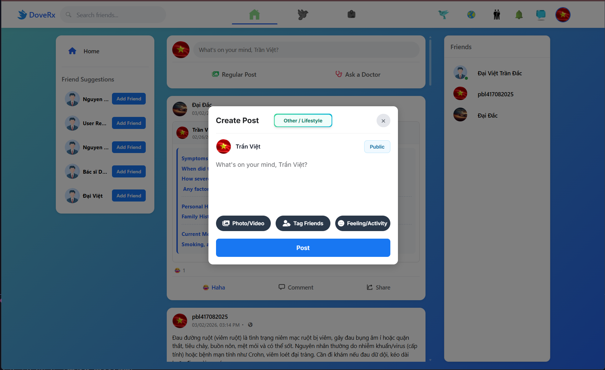
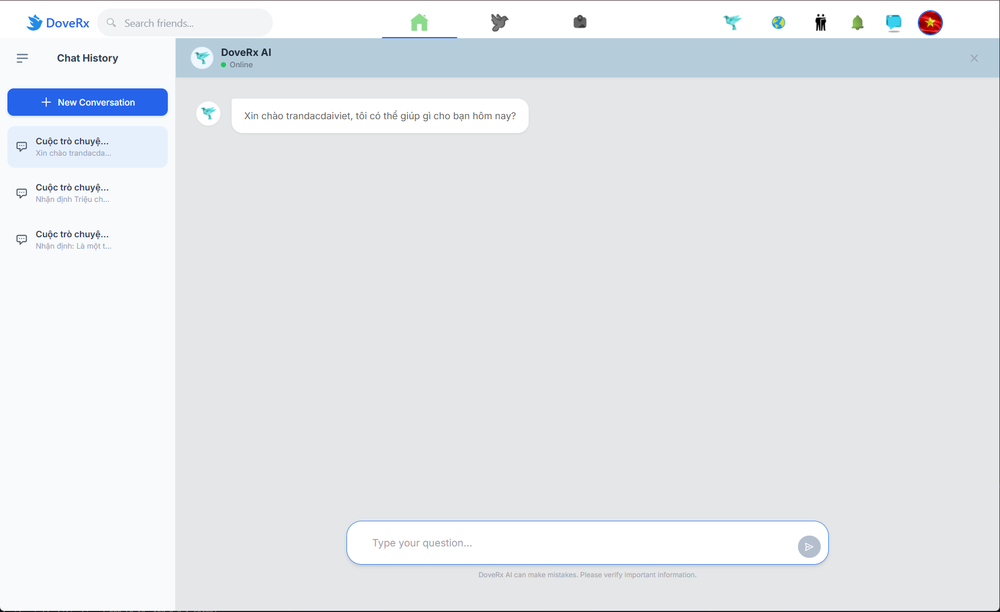
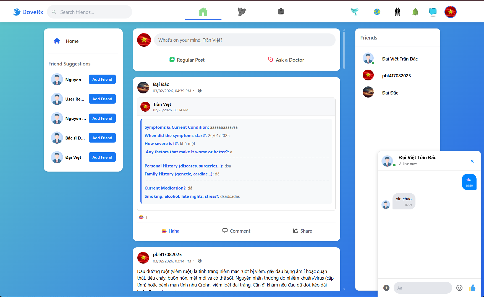
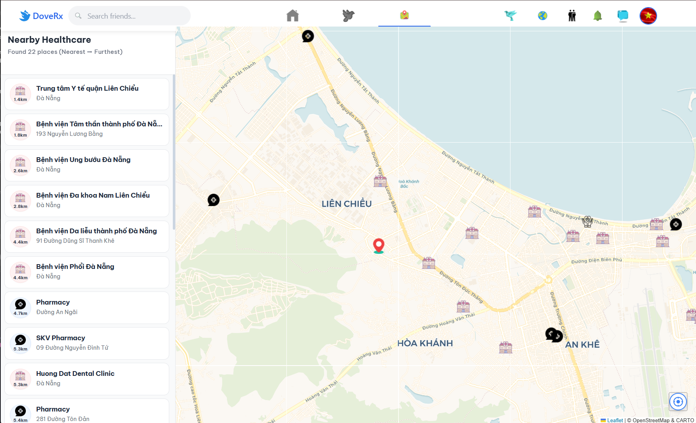
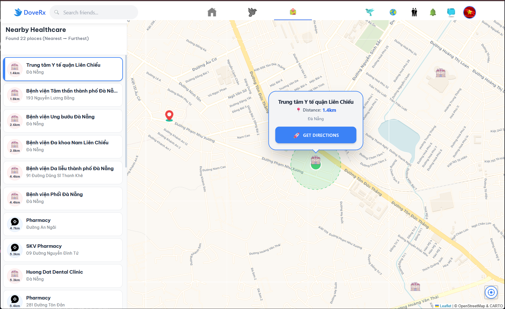
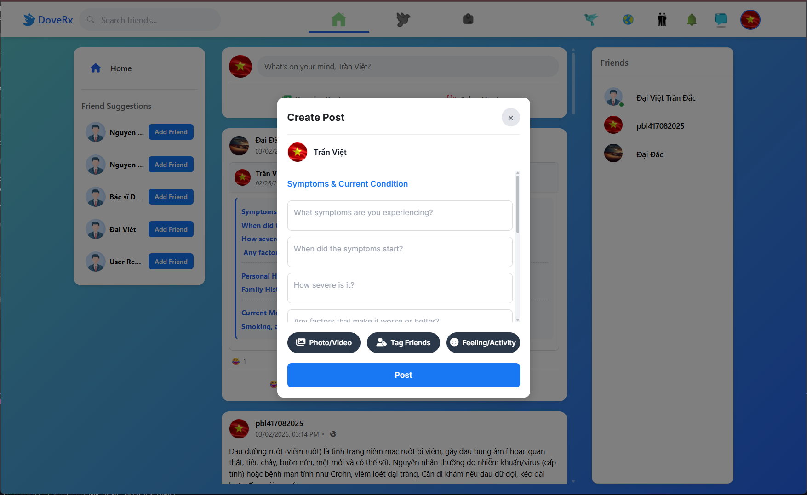
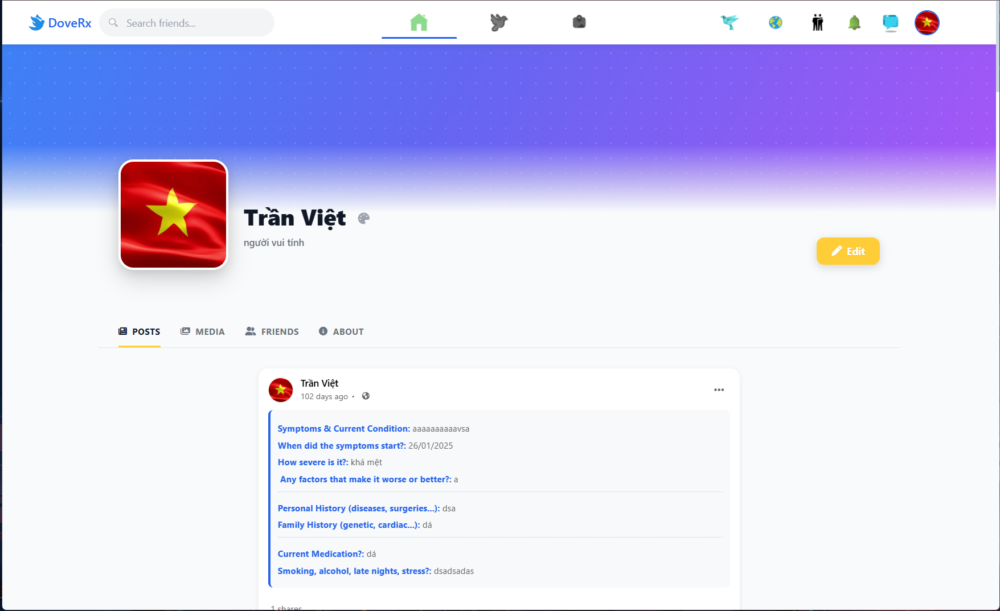

# DoveRx Frontend

Languages: [English](#english) | [Tiếng Việt](#tiếng-việt)

---

## English

**DoveRx Frontend** is the React user interface for DoveRx, a medical social networking platform. The app supports user and doctor authentication, a community feed, Ask a Doctor posts, real-time chat, DoveRx AI, nearby healthcare maps, user profiles, and admin management.

The frontend communicates with a Django REST Framework backend, uses JWT for authentication, WebSocket for real-time chat/notifications, and Google OAuth for quick login.

### Key Features

- **User authentication:** Google OAuth login, user login/registration, doctor login/registration, and doctor verification.
- **Social feed:** regular posts, Ask a Doctor medical posts, reactions, comments, and sharing.
- **Friends and chat:** friend suggestions, friend list, chat popup, and WebSocket message sync.
- **DoveRx AI:** AI Q&A interface with conversation history.
- **Nearby Healthcare:** Leaflet map showing hospitals, clinics, pharmacies, and directions.
- **User profile:** posts, media, friends, about tab, profile editing, and structured medical posts.
- **Admin dashboard:** user and doctor management.
- **Internationalization:** i18next setup for Vietnamese, English, and Japanese.

### Main Screens

#### 1. Home Feed and Regular Post Creation

The Home screen shows the feed, friend suggestions, friend list, and the Regular Post creation modal. Users can write content, select visibility, attach photo/video, tag friends, and publish posts.



#### 2. DoveRx AI Chat

DoveRx AI includes a conversation history sidebar, a central Q&A area, and a question input at the bottom. It helps users ask health-related questions and revisit previous conversations.



#### 3. Home Feed with Friend Chat Popup

The Home screen can display a real-time chat popup while the user browses posts. Users can like, comment, share, and chat with friends without leaving the feed.



#### 4. Nearby Healthcare - Overview Map

The healthcare map displays nearby medical locations such as hospitals, clinics, pharmacies, and other care providers. The left panel sorts places from nearest to farthest.



#### 5. Nearby Healthcare - Place Detail

When a place is selected, the map focuses on the area and shows a popup with the facility name, distance, address, and a Get Directions action.



#### 6. Ask a Doctor - Medical Post Creation

The Ask a Doctor modal uses a structured symptom form so users can send clearer medical questions. Fields include current condition, start date, severity, triggers, personal/family history, and current medication.



#### 7. Profile and User Posts

The Profile screen shows avatar, display name, short bio, edit button, and tabs for Posts, Media, Friends, and About. The Posts tab focuses on the user's posts, including structured medical posts.



### Tech Stack

- **React:** React 19, Hooks, local/component state.
- **Routing:** React Router DOM 7.
- **Build/dev server:** Vite, with Create React App scripts kept for compatibility.
- **HTTP:** Axios with a custom API instance and interceptors.
- **Realtime:** native WebSocket services for chat and notifications.
- **Map:** Leaflet, React Leaflet, OpenStreetMap/CARTO tiles.
- **Auth:** JWT, Google OAuth, token refresh.
- **UI:** component-level CSS files, React Toastify, React Easy Crop, React Image Crop.
- **i18n:** i18next, react-i18next, browser language detector.
- **Markdown:** react-markdown and remark-gfm for AI/chat content.

### Project Structure

```bash
DoveRx-frontend/
|-- docs/screenshots/         # Screenshots used in this README
|-- public/                   # Static assets
|-- src/
|   |-- api/                  # Axios instance and module APIs
|   |-- assets/               # Logo and UI images
|   |-- components/           # Navbar, Chat, Dashboard, Profile, Admin...
|   |-- config/               # Runtime environment config
|   |-- locales/              # Translation files: en/vi/ja
|   |-- pages/                # Login, Dashboard, HealthMap, Profile, Doctor pages
|   |-- services/             # Auth, chat API, WebSocket, friend API
|   |-- styles/               # Page/component CSS
|   `-- utils/                # Time, image, cache, and post mapping helpers
|-- index.html                # Vite HTML entry
|-- package.json
`-- vite.config.mjs
```

### Requirements

- **Node.js:** Node 18+ is recommended.
- **npm:** included with Node.js.
- **DoveRx Backend:** required for API, WebSocket, authentication, and application data.

### Environment Variables

Create `.env` from `.env.example`:

```bash
REACT_APP_API_BASE=http://127.0.0.1:8010
REACT_APP_WS_BASE=ws://127.0.0.1:8010
REACT_APP_GOOGLE_CLIENT_ID=replace-with-google-client-id
```

Variable meanings:

- `REACT_APP_API_BASE`: backend REST API URL.
- `REACT_APP_WS_BASE`: backend WebSocket URL. If omitted, the app infers it from `REACT_APP_API_BASE`.
- `REACT_APP_GOOGLE_CLIENT_ID`: Google OAuth Client ID for Google login.

### Local Setup

```bash
npm install
npm run dev
```

Vite runs at:

```bash
http://localhost:3000
```

To run with Create React App:

```bash
npm start
```

### Scripts

- `npm run dev`: start the Vite development server.
- `npm run build:vite`: build production output with Vite.
- `npm run build`: build production output with Create React App.
- `npm test`: run tests with React Scripts/Jest.
- `npm start`: start the Create React App development server.

### Pre-deploy Check

```bash
npm test
npm run build:vite
```

For deployment, configure production values for `REACT_APP_API_BASE`, `REACT_APP_WS_BASE`, and `REACT_APP_GOOGLE_CLIENT_ID`.

### Backend Integration Notes

The frontend depends on these backend/API groups:

- Accounts/auth: login, Google OAuth, refresh token, user profile.
- Social/posts: feed, posts, reactions, comments, sharing.
- Chat/WebSocket: real-time messaging and online status.
- Friends: friend suggestions, friend list, friendship status.
- Admin/doctors: user management, doctor management, doctor verification.
- Healthcare map: nearby healthcare location data.

---

## Tiếng Việt

**DoveRx Frontend** là giao diện React cho DoveRx, một nền tảng mạng xã hội y tế. Ứng dụng hỗ trợ đăng nhập người dùng/bác sĩ, bảng tin cộng đồng, bài viết hỏi bác sĩ, chat thời gian thực, DoveRx AI, bản đồ cơ sở y tế gần người dùng, hồ sơ cá nhân và trang quản trị.

Frontend giao tiếp với backend Django REST Framework, dùng JWT cho xác thực, WebSocket cho chat/thông báo thời gian thực và Google OAuth cho đăng nhập nhanh.

### Tính Năng Chính

- **Xác thực người dùng:** đăng nhập Google OAuth, đăng nhập/đăng ký tài khoản người dùng, đăng nhập/đăng ký bác sĩ và xác minh bác sĩ.
- **Bảng tin xã hội:** tạo bài viết thường, tạo bài viết y tế Ask a Doctor, xem bài viết, thả cảm xúc, bình luận và chia sẻ.
- **Bạn bè và chat:** gợi ý kết bạn, danh sách bạn bè, popup chat và đồng bộ tin nhắn qua WebSocket.
- **DoveRx AI:** giao diện hỏi đáp AI kèm lịch sử hội thoại.
- **Nearby Healthcare:** bản đồ Leaflet hiển thị bệnh viện, phòng khám, nhà thuốc và chỉ đường.
- **Hồ sơ cá nhân:** xem bài viết, media, bạn bè, thông tin cá nhân, chỉnh sửa hồ sơ và xem bài viết y tế dạng cấu trúc.
- **Quản trị:** trang admin để quản lý người dùng và bác sĩ.
- **Đa ngôn ngữ:** cấu hình i18next cho tiếng Việt, tiếng Anh và tiếng Nhật.

### Các Màn Hình Chính

#### 1. Bảng Tin Và Tạo Bài Viết Thường

Màn hình Home hiển thị bảng tin, gợi ý kết bạn, danh sách bạn bè và modal tạo bài viết dạng Regular Post. Người dùng có thể nhập nội dung, chọn chế độ hiển thị, thêm ảnh/video, gắn thẻ bạn bè và đăng bài.


#### 2. DoveRx AI Chat

Màn hình DoveRx AI có thanh lịch sử hội thoại bên trái, khu vực hỏi đáp trung tâm và ô nhập câu hỏi ở cuối màn hình. Tính năng này hỗ trợ người dùng đặt câu hỏi sức khỏe và xem lại các cuộc trò chuyện trước đó.


#### 3. Bảng Tin Và Cửa Sổ Chat Bạn Bè

Màn hình Home kết hợp với popup chat thời gian thực. Người dùng có thể xem bài viết, tương tác bằng Like/Comment/Share và trò chuyện trực tiếp với bạn bè trong cửa sổ chat nhỏ.


#### 4. Nearby Healthcare - Bản Đồ Tổng Quan

Màn hình bản đồ hiển thị các địa điểm y tế gần người dùng, bao gồm bệnh viện, phòng khám, nhà thuốc và các điểm chăm sóc sức khỏe. Danh sách bên trái được sắp xếp theo khoảng cách từ gần đến xa.


#### 5. Nearby Healthcare - Chi Tiết Địa Điểm

Khi chọn một địa điểm, bản đồ phóng to khu vực và hiển thị popup thông tin gồm tên cơ sở, khoảng cách, địa chỉ và nút Get Directions để người dùng mở hướng dẫn đường đi.


#### 6. Ask a Doctor - Tạo Bài Viết Y Tế

Modal Ask a Doctor gồm form triệu chứng và thông tin nền tảng sức khỏe, giúp người dùng gửi câu hỏi có cấu trúc hơn cho bác sĩ. Các trường gồm tình trạng hiện tại, thời điểm bắt đầu, mức độ nghiêm trọng, yếu tố ảnh hưởng, tiền sử cá nhân/gia đình và thuốc đang dùng.


#### 7. Trang Cá Nhân Và Danh Sách Bài Viết

Trang Profile hiển thị ảnh đại diện, tên người dùng, mô tả ngắn, nút chỉnh sửa và các tab Posts, Media, Friends, About. Tab Posts tập trung vào các bài viết của người dùng, bao gồm cả bài viết y tế dạng cấu trúc.


### Công Nghệ Sử Dụng

- **React:** React 19, Hooks, state theo component.
- **Routing:** React Router DOM 7.
- **Build/dev server:** Vite, có giữ script Create React App để tương thích.
- **HTTP:** Axios với custom API instance và interceptor.
- **Realtime:** native WebSocket service cho chat và notification.
- **Map:** Leaflet, React Leaflet, OpenStreetMap/CARTO tiles.
- **Auth:** JWT, Google OAuth, token refresh.
- **UI:** CSS theo component, React Toastify, React Easy Crop, React Image Crop.
- **i18n:** i18next, react-i18next, browser language detector.
- **Markdown:** react-markdown và remark-gfm cho nội dung AI/chat.

### Cấu Trúc Thư Mục

```bash
DoveRx-frontend/
|-- docs/screenshots/         # Ảnh minh họa dùng trong README
|-- public/                   # Static assets
|-- src/
|   |-- api/                  # Axios instance và API theo module
|   |-- assets/               # Logo và hình ảnh dùng trong UI
|   |-- components/           # Navbar, Chat, Dashboard, Profile, Admin...
|   |-- config/               # Cấu hình môi trường runtime
|   |-- locales/              # File dịch en/vi/ja
|   |-- pages/                # Login, Dashboard, HealthMap, Profile, Doctor pages
|   |-- services/             # Auth, chat API, WebSocket, friend API
|   |-- styles/               # CSS theo màn hình/component
|   `-- utils/                # Helper xử lý thời gian, ảnh, cache và map post
|-- index.html                # Entry HTML cho Vite
|-- package.json
`-- vite.config.mjs
```

### Yêu Cầu Môi Trường

- **Node.js:** khuyến nghị Node 18+.
- **npm:** đi kèm Node.js.
- **Backend DoveRx:** cần chạy backend Django để các API, WebSocket, đăng nhập và dữ liệu hoạt động đầy đủ.

### Biến Môi Trường

Tạo file `.env` từ `.env.example`:

```bash
REACT_APP_API_BASE=http://127.0.0.1:8010
REACT_APP_WS_BASE=ws://127.0.0.1:8010
REACT_APP_GOOGLE_CLIENT_ID=replace-with-google-client-id
```

Ý nghĩa:

- `REACT_APP_API_BASE`: URL backend REST API.
- `REACT_APP_WS_BASE`: URL WebSocket backend. Nếu không khai báo, app sẽ suy ra từ `REACT_APP_API_BASE`.
- `REACT_APP_GOOGLE_CLIENT_ID`: Google OAuth Client ID dùng cho đăng nhập Google.

### Cài Đặt Và Chạy Local

```bash
npm install
npm run dev
```

Mặc định Vite chạy tại:

```bash
http://localhost:3000
```

Nếu cần chạy theo Create React App:

```bash
npm start
```

### Scripts

- `npm run dev`: chạy Vite dev server.
- `npm run build:vite`: build production bằng Vite.
- `npm run build`: build production bằng Create React App.
- `npm test`: chạy test bằng React Scripts/Jest.
- `npm start`: chạy dev server theo Create React App.

### Kiểm Tra Trước Khi Deploy

```bash
npm test
npm run build:vite
```

Khi deploy, cần cấu hình các biến môi trường tương ứng với backend production, đặc biệt là `REACT_APP_API_BASE`, `REACT_APP_WS_BASE` và `REACT_APP_GOOGLE_CLIENT_ID`.

### Ghi Chú Tích Hợp Backend

Frontend phụ thuộc vào các nhóm API/backend sau:

- Accounts/auth: đăng nhập, Google OAuth, refresh token, hồ sơ người dùng.
- Social/posts: bảng tin, bài viết, reaction, comment, share.
- Chat/WebSocket: nhắn tin real-time và trạng thái online.
- Friends: gợi ý kết bạn, danh sách bạn bè, trạng thái kết bạn.
- Admin/doctors: quản lý người dùng, bác sĩ và luồng xác minh bác sĩ.
- Healthcare map: dữ liệu vị trí cơ sở y tế gần người dùng.
